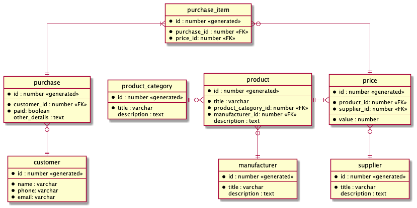

# course-db-01

# Схема

# Документация
**manufacturer** -
Производитель продукта, изготавливает продукты.

**supplier** - Поставщик продукта, поставляет продукты разных поставщиков по своей цене.

**product_category** - Категория производимого продукта.

**product** - Продукт, имеет конкретную категорию и производителя, может поставляться разными поставщиками.

**price** -Цена продукта, зависит от поставщика, который предоставляет данный продукт.

**customer** - Покупатель, может совершать покупки в магазине.

**purchase** - Покупка, совершается покупателем и может включать одну или несколько единиц продукта.

**purchase_item** - Единица продукта в покупке по цене одного из поставщиков.
